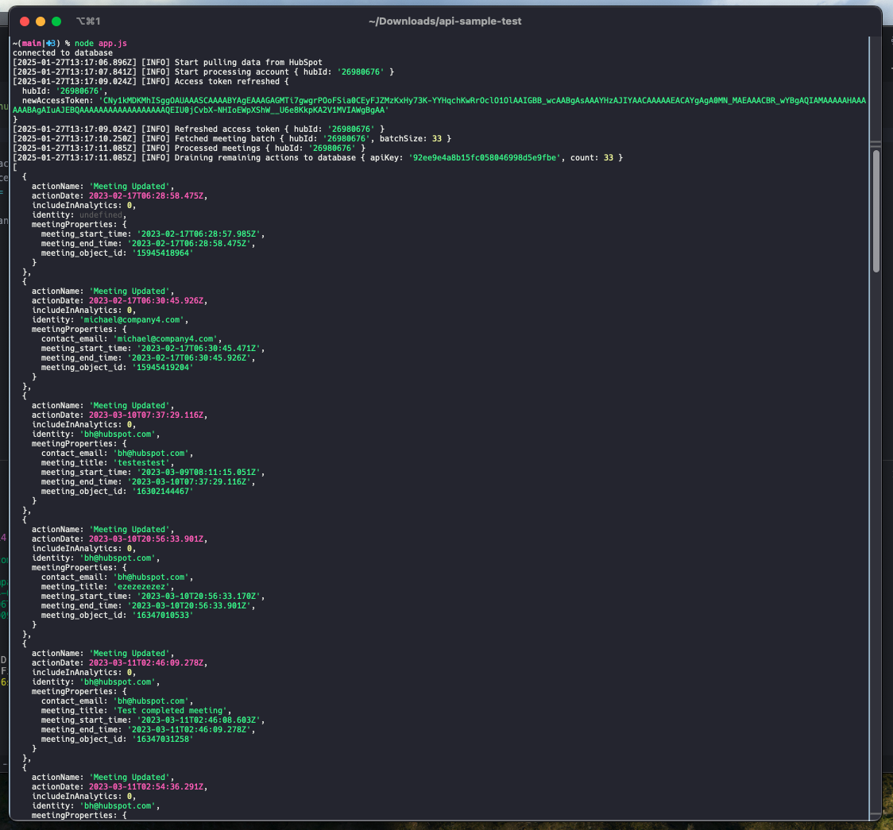
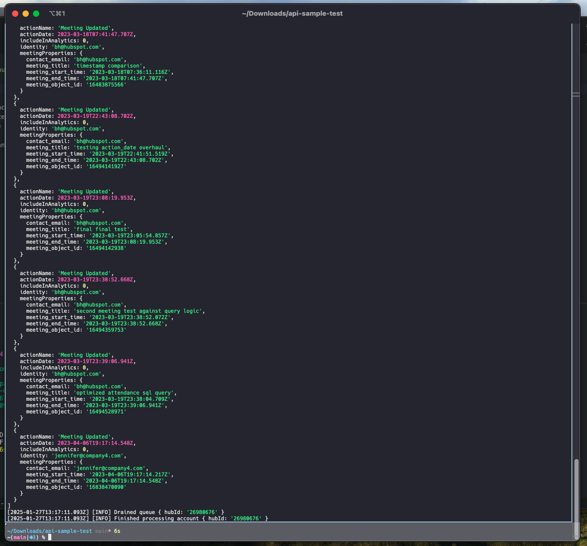

# API Sample Test

## Getting Started

This project requires a newer version of Node. Don't forget to install the NPM packages afterwards.

You should change the name of the ```.env.example``` file to ```.env```.

Run ```node app.js``` to get things started. Hopefully the project should start without any errors.

---

## Debrief

Besides the `processMeetings` function I did the following:
- Hubspot client singleton (`services/hubspot.js`)
- Better logging system based on levels (`logger.js`)
- Added try/catch on possible failure points (`worker.js`)

> How you would improve this project in terms of (1) code quality and readability, (2) project architecture, and especially (3) code performance.

#### 1. Code quality and readability:
**Single Responsibility Principle:** Ensure each function is dedicated to a single task. For instance, the `processCompanies` function currently manages both the fetching and processing of company data. Additionally, improve the project by using a type-safe language like TypeScript, incorporating documentation comments, and maintaining consistent naming conventions.

#### 2. Project architecture:
**Event-driven architecture:** Improve our system's modularity, maintainability and scalability. By decoupling the processing of different entities, we make the codebase more flexible and easier to manage.

#### 3. Code performance:
**N+1 problem:** Right now every time we process a meeting, we also request contact by ID. We could analyze the data and see if we can cache the contacts, or JOIN the requests and reduce the number of requests.
**Reduce queue concurrency:** Right now we are processing 100000000 actions at a time, I have the feeling that this is an overestimated number. Check the system and see if we can reduce the concurrency to a more reasonable number.
**Batch processing (?):** Not sure if the API supports batch processing, but if it does, we could use it to improve the performance of the system.
**Caching:** Add Redis or other caching layer to reduce unnecessary requests.
**Parallel processing:** Process multiple entities in parallel to improve the performance of the system (related to event-driven arch).

## Screenshots


